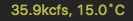

# WaterStatus
-
WaterStatus is a [BitBar](https://github.com/matryer/bitbar) plugin intended for rowers and paddlers in Pittsburgh that displays current flow rate and temperature of the Allegheny River, and determines the corresponding safety zone and rules for crews rowing out of [Three Rivers Rowing Association](http://threeriversrowing.org/).

### Screenshots:

### Notes:
- Temperature is retrieved from the [Acmetonia](https://waterdata.usgs.gov/usa/nwis/uv?03049640) station
- Flow is retrieved from the [Natrona](https://waterdata.usgs.gov/usa/nwis/uv?03049500) station 
  - Boathouse has switched to using the Sharpsburg station below the dam near 62nd street, will switch or display both & prioritize Sharpsburg in next version
- Daylight (sunrise/sunset), Wind, & Storm conditions are not fetched but are safety matrix features
- [Safety Matrix](http://threeriversrowing.org/wp-content/uploads/2013/06/Safety-Matrix-Updated-3.31.15.pdf) notes are based on 2015 version -- needs to be updated to 2017
- currently does not fail gracefully when internet connection falters or the XML requests take too long
- possible future features: daily/weekly graph of values, + displayed prediction

